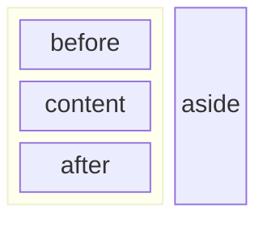
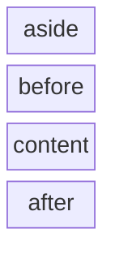

The default component layout uses a main column with a smaller column aside.

Desktop:



Mobile:



The aside column can be customized by {@link overriding-templates overriding the partial}:

- `partials/component-aside.html`

To fully customize the component override the component layout:

- `component.html`

## Containers

To add custom widgets to the component, append them to one of the containers:

- `component:aside` - widget is placed in the aside column.
- `component:top` - widget is placed above the main content.
- `component:bottom` - widget is placed below the main content.

```ts
import { type ProcessorContext } from "@forsakringskassan/docs-generator";

declare const context: ProcessorContext;

/* --- cut above --- */

context.addTemplateBlock("component:top", "awesome-doodad", {
    filename: "partials/awesome-doodad.html",
});
```
