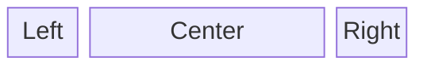

The default footer uses three columns:



Each column can be customized by {@link overriding-templates overriding the partials}:

- `partials/footer-left.html`
- `partials/footer-center.html`
- `partials/footer-right.html`

To fully customize the footer override the footer partial:

- `partials/footer.html`

## Helper classes

To add lists use the `docs-footer__link-list` class:

```html static
<ul class="docs-footer__link-list">
    <li>foo</li>
    <li>bar</li>
    <li>baz</li>
</ul>
```

To add links use the `docs-footer__anchor` class:

```html static
<a class="docs-footer__anchor"> lorem ipsum </a>
```

## Containers

To add custom widgets to the footer, append them to one of the containers:

- `footer:left` - widget is placed in the left column.
- `footer:center` - widget is placed in the center column.
- `footer:right` - widget is placed in the right column.
- `footer` - widget is placed in an unspecified column (default right).

```ts
import { type ProcessorContext } from "@forsakringskassan/docs-generator";

declare const context: ProcessorContext;

/* --- cut above --- */

context.addTemplateBlock("footer:left", "awesome-doodad", {
    filename: "partials/awesome-doodad.html",
});
```
