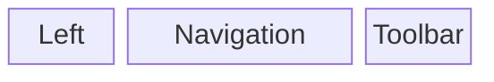
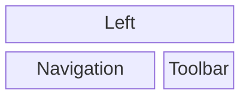

The default header uses tree columns (stacked in mobile):

Desktop:



Mobile:



Each column can be customized by {@link overriding-templates overriding the partials}:

- `partials/header-left.html`
- `partials/mobile-nav.html`
- `partials/topnav.html`

To fully customize the header override the header partial:

- `partials/header.html`

## Containers

To add custom widgets to the header, append them to one of the containers:

- `header:left` - widget is placed in the left column.
- `toolbar` - widget is placed in the right column.

```ts
import { type ProcessorContext } from "@forsakringskassan/docs-generator";

declare const context: ProcessorContext;

/* --- cut above --- */

context.addTemplateBlock("toolbar", "awesome-doodad", {
    filename: "partials/awesome-doodad.html",
});
```
