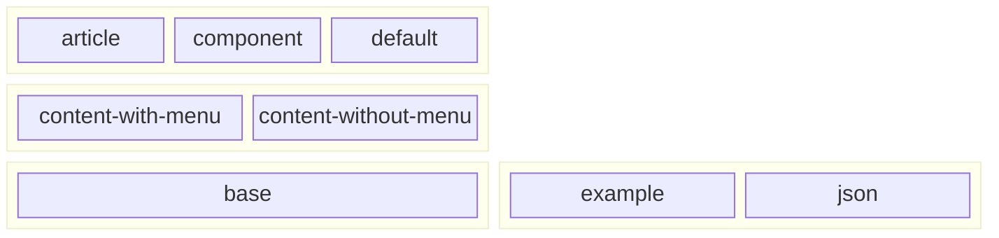

Layouts are loaded in a hierarcy:

```mermaid
block-beta
  columns 2

  block
    article
    component
    def["default"]
  end

  space

  block
    with["content-with-menu"]
    without["content-without-menu"]
  end

  space

  block
    base
  end

  block
    example
    json
  end
```

By overriding one of the base templates you modify how all templates extending it works and what content it has access to.
