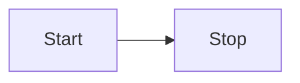

Diagrams and charts can be created with [Mermaid](https://mermaid.js.org/) in markdown.

For instance, a flowchart can be created with:

````md

```mermaid
flowchart LR
    Start --> Stop
```
````

Above will be rendered as:


```mermaid
flowchart LR
    Start --> Stop
```
