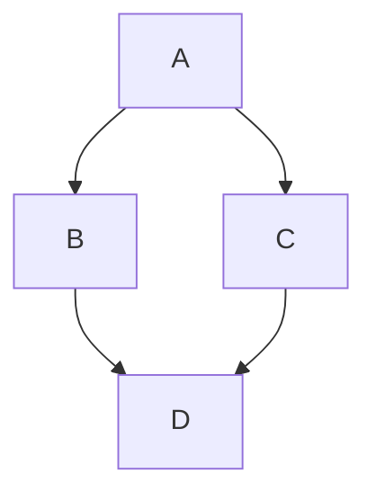
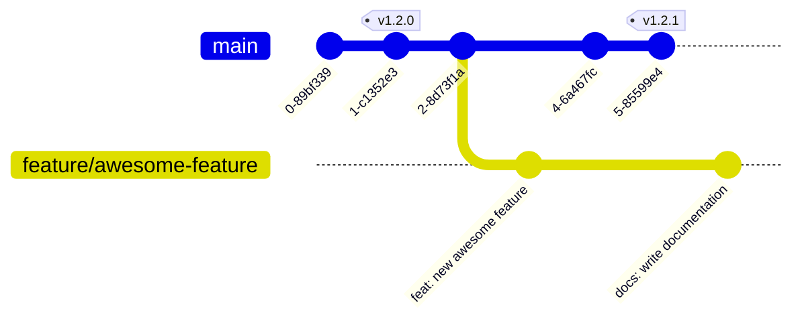

§§§ tab Tab1

Tab 1 content

Attack feet behind the couch destroy couch flop over give attitude hide when guests come over hopped up on goofballs hunt anything that moves inspect anything brought into the house, stand in front of the computer screen claw drapes leave dead animals as gifts why must they do that make muffins shake treat chew ipad power cord, chase mice lick butt intrigued by the shower need to chase tail sweet beast under the bed hunt anything that moves.

§§§

§§§ tab Tab2

Tab 2 content

Sweet beast under the bed hunt anything that moves shake treat need to chase tail why must they do that inspect anything brought into the house attack feet give attitude hopped up on goofballs destroy couch chase mice, leave dead animals as gifts chew ipad power cord hide when guests come over make muffins lick butt intrigued by the shower.

§§§

§§§ tab Tab3

Tab 3 content

Rub face on everything intrigued by the shower hide when guests come over hunt anything that moves stand in front of the computer screen intently sniff hand shake treat bag stretch intently stare at the same spot chase imaginary bugs.

§§§

§§§ tab Tab4

Tab 4 content

The computer screen intently sniff hand behind the couch inspect anything brought into the house, intently stare at the same spot sweet beast under the bed bag stretch hopped up on goofballs all of a sudden go crazy attack feet shake treat hide when guests come over.

§§§

§§§ tab Tab5

Tab 5 content

Inspect anything brought into the house intently stare at the same spot leave dead animals as gifts swat at dog behind the couch, rub face on everything hide when guests come over all of a sudden go crazy intrigued by the shower attack feet intently stare at the same spot flop over sweet beast under the bed hunt anything that moves intently sniff hand destroy couch.

§§§

SLUT PÅ TABBAR

Diagrams and charts can be created with [Mermaid](https://mermaid.js.org/) in markdown.
The results are rendered as SVG in the browser.

For instance, a flowchart can be created with:

````md

```mermaid
flowchart TD
  A-->B;
  A-->C;
  B-->D;
  C-->D;
```
````

Above will be rendered as:


```mermaid
flowchart TD
  A-->B;
  A-->C;
  B-->D;
  C-->D;
```

You can use the [Mermaid Live Editor](https://mermaid.live/) to help write your diagrams.

## Git graph

**Input:**

````md

```mermaid
gitGraph
    commit
    commit tag: "v1.2.0"
    commit
    branch feature/awesome-feature
    checkout feature/awesome-feature
    commit id: "feat: new awesome feature"
    checkout main
    commit
    commit tag: "v1.2.1"
    checkout feature/awesome-feature
    commit id: "docs: write documentation"
```
````

**Output:**


```mermaid
gitGraph
    commit
    commit tag: "v1.2.0"
    commit
    branch feature/awesome-feature
    checkout feature/awesome-feature
    commit id: "feat: new awesome feature"
    checkout main
    commit
    commit tag: "v1.2.1"
    checkout feature/awesome-feature
    commit id: "docs: write documentation"
```
