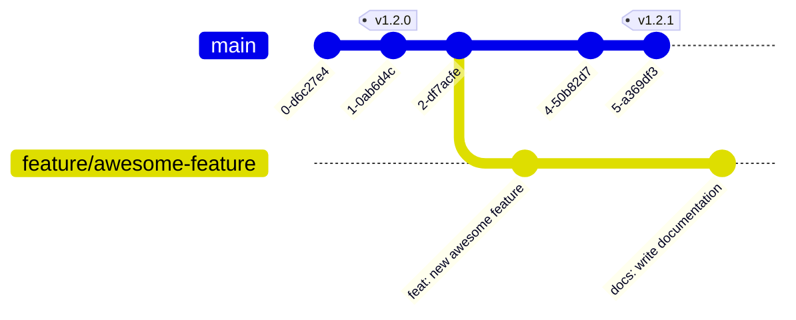

Diagrams and charts can be created with [Mermaid](https://mermaid.js.org/) in markdown.
The results are rendered as SVG in the browser.

For instance, a flowchart can be created with:

````md

````

Above will be rendered as:


You can use the [Mermaid Live Editor](https://mermaid.live/) to help write your diagrams.

## Git graph

**Input:**

````md

````

**Output:**


