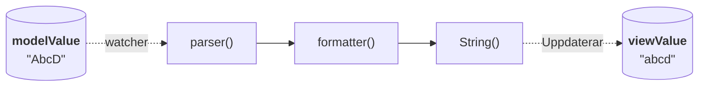

## Programmatisk uppdatering av model-värde 1

Vid programmatisk uppdatering av model-värde uppdateras vy-värde automatiskt.
Vy-värdet formateras om en formaterare är angiven.
Om även en parser är angiven utöver formaterare så parsas värdet innan det formateras.
Misslyckas parsning eller formatering på vägen så sätts vy-värdet till model-värdet.

## Relaterat 1

## Programmatisk uppdatering av model-värde 2

Vid programmatisk uppdatering av model-värde uppdateras vy-värde automatiskt.
Vy-värdet formateras om en formaterare är angiven.
Om även en parser är angiven utöver formaterare så parsas värdet innan det formateras.
Misslyckas parsning eller formatering på vägen så sätts vy-värdet till model-värdet.

## Relaterat 2

## Programmatisk uppdatering av model-värde 3

Vid programmatisk uppdatering av model-värde uppdateras vy-värde automatiskt.
Vy-värdet formateras om en formaterare är angiven.
Om även en parser är angiven utöver formaterare så parsas värdet innan det formateras.
Misslyckas parsning eller formatering på vägen så sätts vy-värdet till model-värdet.

## Relaterat 3

## Programmatisk uppdatering av model-värde 4

Vid programmatisk uppdatering av model-värde uppdateras vy-värde automatiskt.
Vy-värdet formateras om en formaterare är angiven.
Om även en parser är angiven utöver formaterare så parsas värdet innan det formateras.
Misslyckas parsning eller formatering på vägen så sätts vy-värdet till model-värdet.

## Relaterat 4

## Programmatisk uppdatering av model-värde 5

Vid programmatisk uppdatering av model-värde uppdateras vy-värde automatiskt.
Vy-värdet formateras om en formaterare är angiven.
Om även en parser är angiven utöver formaterare så parsas värdet innan det formateras.
Misslyckas parsning eller formatering på vägen så sätts vy-värdet till model-värdet.

## Relaterat 5

## Programmatisk uppdatering av model-värde 6

Vid programmatisk uppdatering av model-värde uppdateras vy-värde automatiskt.
Vy-värdet formateras om en formaterare är angiven.
Om även en parser är angiven utöver formaterare så parsas värdet innan det formateras.
Misslyckas parsning eller formatering på vägen så sätts vy-värdet till model-värdet.

## Relaterat 6

## Programmatisk uppdatering av model-värde 7

Vid programmatisk uppdatering av model-värde uppdateras vy-värde automatiskt.
Vy-värdet formateras om en formaterare är angiven.
Om även en parser är angiven utöver formaterare så parsas värdet innan det formateras.
Misslyckas parsning eller formatering på vägen så sätts vy-värdet till model-värdet.

## Relaterat 7

## Programmatisk uppdatering av model-värde 8

Vid programmatisk uppdatering av model-värde uppdateras vy-värde automatiskt.
Vy-värdet formateras om en formaterare är angiven.
Om även en parser är angiven utöver formaterare så parsas värdet innan det formateras.
Misslyckas parsning eller formatering på vägen så sätts vy-värdet till model-värdet.

## Relaterat 8

## Programmatisk uppdatering av model-värde 9

Vid programmatisk uppdatering av model-värde uppdateras vy-värde automatiskt.
Vy-värdet formateras om en formaterare är angiven.
Om även en parser är angiven utöver formaterare så parsas värdet innan det formateras.
Misslyckas parsning eller formatering på vägen så sätts vy-värdet till model-värdet.

## Relaterat 9

## Programmatisk uppdatering av model-värde 10

Vid programmatisk uppdatering av model-värde uppdateras vy-värde automatiskt.
Vy-värdet formateras om en formaterare är angiven.
Om även en parser är angiven utöver formaterare så parsas värdet innan det formateras.
Misslyckas parsning eller formatering på vägen så sätts vy-värdet till model-värdet.

## Relaterat 10
