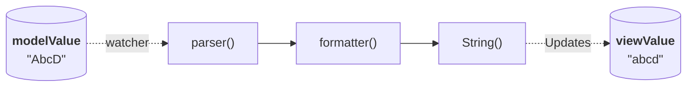

## Programmatic Update of Model Value 1

When programmatically updating the model value, the view value updates automatically.
The view value is reformatted if a formatter is specified.
If a parser is also specified in addition to the formatter, the value is parsed before it is formatted.
If parsing or formatting fails along the way, the view value is set to the model value.

## Related 1

## Programmatic Update of Model Value 2

When programmatically updating the model value, the view value updates automatically.
The view value is reformatted if a formatter is specified.
If a parser is also specified in addition to the formatter, the value is parsed before it is formatted.
If parsing or formatting fails along the way, the view value is set to the model value.

## Related 2

## Programmatic Update of Model Value 3

When programmatically updating the model value, the view value updates automatically.
The view value is reformatted if a formatter is specified.
If a parser is also specified in addition to the formatter, the value is parsed before it is formatted.
If parsing or formatting fails along the way, the view value is set to the model value.

## Related 3

## Programmatic Update of Model Value 4

When programmatically updating the model value, the view value updates automatically.
The view value is reformatted if a formatter is specified.
If a parser is also specified in addition to the formatter, the value is parsed before it is formatted.
If parsing or formatting fails along the way, the view value is set to the model value.

## Related 4

## Programmatic Update of Model Value 5

When programmatically updating the model value, the view value updates automatically.
The view value is reformatted if a formatter is specified.
If a parser is also specified in addition to the formatter, the value is parsed before it is formatted.
If parsing or formatting fails along the way, the view value is set to the model value.

## Related 5

## Programmatic Update of Model Value 6

When programmatically updating the model value, the view value updates automatically.
The view value is reformatted if a formatter is specified.
If a parser is also specified in addition to the formatter, the value is parsed before it is formatted.
If parsing or formatting fails along the way, the view value is set to the model value.

## Related 6

## Programmatic Update of Model Value 7

When programmatically updating the model value, the view value updates automatically.
The view value is reformatted if a formatter is specified.
If a parser is also specified in addition to the formatter, the value is parsed before it is formatted.
If parsing or formatting fails along the way, the view value is set to the model value.

## Related 7

## Programmatic Update of Model Value 8

When programmatically updating the model value, the view value updates automatically.
The view value is reformatted if a formatter is specified.
If a parser is also specified in addition to the formatter, the value is parsed before it is formatted.
If parsing or formatting fails along the way, the view value is set to the model value.

## Related 8

## Programmatic Update of Model Value 9

When programmatically updating the model value, the view value updates automatically.
The view value is reformatted if a formatter is specified.
If a parser is also specified in addition to the formatter, the value is parsed before it is formatted.
If parsing or formatting fails along the way, the view value is set to the model value.

## Related 9

## Programmatic Update of Model Value 10

When programmatically updating the model value, the view value updates automatically.
The view value is reformatted if a formatter is specified.
If a parser is also specified in addition to the formatter, the value is parsed before it is formatted.
If parsing or formatting fails along the way, the view value is set to the model value.

## Related 10
